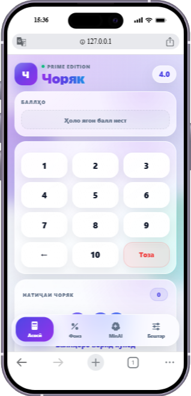
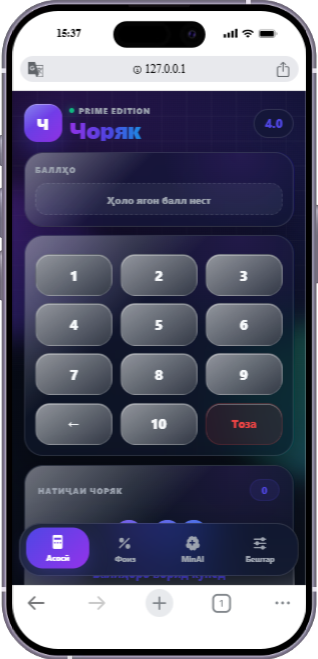
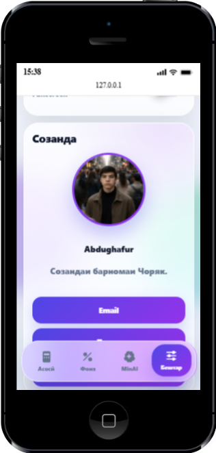

# ✨ Чоряк

### AI-Powered Quarterly Grade Calculator

Modern glassmorphism web app for grade calculation, percentage analytics, and intelligent student analysis.

---

# 🇹🇯 Тоҷикӣ

## 📖 Дар бораи лоиҳа

**Чоряк** — веб-барномаи муосир барои ҳисоб кардани натиҷаи чоряк, процент ва таҳлили интеллектуалии сатҳи хонандагон.

Ин барнома бо интерфейси glassmorphism ва услуби замонавӣ сохта шудааст.

---

## ✨ Имкониятҳо

* 📊 Ҳисоби автоматии чоряк
* 🧠 MinAI AI таҳлил
* 📈 Диаграммаҳои аниматсионӣ
* 🌙 Dark / Light mode
* ⚡ Performance mode
* 🖼 Export PNG
* 📤 Share image
* 💾 LocalStorage
* ⌨ Keyboard shortcuts
* 📱 Mobile responsive UI

---

## 🧠 MinAI

MinAI метавонад:

* сатҳи хонандаро таҳлил кунад
* самти пешрафтро муайян кунад
* хавфҳоро пешгӯӣ кунад
* тавсияҳои интеллектуалӣ диҳад

---

## ⚠ Лицензия

© 2026 Abdughafur — Ҳамаи ҳуқуқҳо ҳифз шудаанд.

Истифодаи бе иҷозат манъ аст.

---

# 🇬🇧 English

## 📖 About Project

**Чоряк** is a modern web application for quarterly grade calculation, percentage analytics, and AI-based student performance analysis.

It is designed with a glassmorphism UI and modern UI/UX principles.

---

## ✨ Features

* 📊 Automatic quarterly grade calculation
* 🧠 MinAI AI analysis system
* 📈 Animated charts
* 🌙 Dark / Light mode
* ⚡ Performance mode
* 🖼 PNG export
* 📤 Image sharing
* 💾 LocalStorage support
* ⌨ Keyboard shortcuts
* 📱 Fully responsive design

---

## 🧠 MinAI

MinAI can:

* analyze student performance
* detect learning trends
* predict risks
* give smart improvement suggestions

---

## ⚠ License

© 2026 Abdughafur — All Rights Reserved.

Unauthorized use, copying, or redistribution is strictly prohibited.

---

# 🇷🇺 Русский

## 📖 О проекте

**Чоряк** — современное веб-приложение для расчёта четвертных оценок, анализа процентов и интеллектуального анализа успеваемости учеников.

Интерфейс выполнен в стиле glassmorphism и современных UI стандартов.

---

## ✨ Возможности

* 📊 Автоматический расчёт четвертной оценки
* 🧠 AI-анализ MinAI
* 📈 Анимированные графики
* 🌙 Тёмная / светлая тема
* ⚡ Performance mode
* 🖼 Экспорт PNG
* 📤 Отправка изображения
* 💾 LocalStorage
* ⌨ Горячие клавиши
* 📱 Адаптивный интерфейс

---

## 🧠 MinAI

MinAI умеет:

* анализировать успеваемость
* выявлять тенденции
* прогнозировать риски
* давать рекомендации по улучшению

---

## ⚠ Лицензия

© 2026 Abdughafur — Все права защищены.

Запрещено копирование, изменение и распространение без разрешения автора.

---

Made with ❤️ in Tajikistan
By Abdughafur Khujzoda

---

# 📸 Screenshots

## ☀ Light Mode

---

## 🌙 Dark Mode

---

## 👨‍💻 Developer

---
